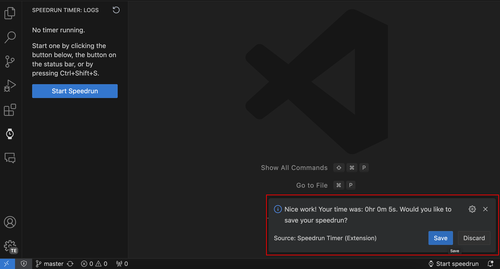

# Speedrun Timer

Ever wanted to show your friends how fast you can code up a project, or how fast you can solve a coding challenge? 

Well, now you can! 

With **Speedrun Timer**, you can time yourself and show your friends who's boss!

## Usage

1. Click the `Start` button on the status bar, use the keyboard shortcut (Ctrl/Cmd+Shift+S by default), or use the command palette to start the timer.
2. Code away!
3. Click the `Xhr Ym Zs` button on the status bar, use the keyboard shortcut (Ctrl/Cmd+Shift+S by default), or use the command palette to stop the timer.
4. Check your speedrun time in the Speedrun Timer side panel!

## Features

* Start and stop the timer on the status bar below.
    * You can start/stop the timer either by clicking the buttons or by using the keyboard shortcuts (Ctrl/Cmd+Shift+S by default).
     
    

* Save your speedrun to the Speedrun Timer side panel.
     
    
    * Add a cool name to your speedrun.
     
    
    * Check your time, date, and name of your speedrun.
     
    

* Delete previous speedruns from the log.
 

## Future Work
- [ ] Add number of lines written to the log.
- [ ] Add number of words written to the log.
- [ ] Add words per minute to the log.
- [ ] Enable user to change the name of the speedrun.
- [ ] Enable user to change the keyboard shortcuts.